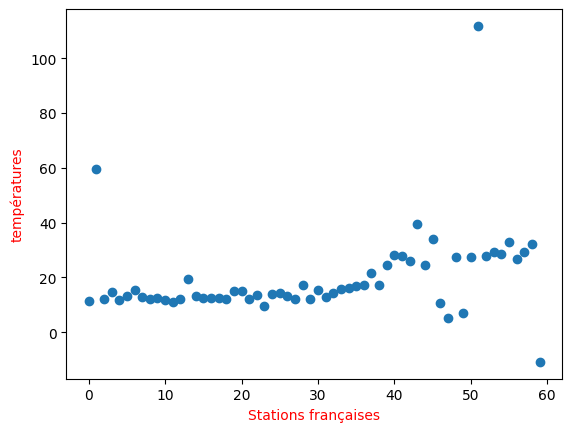

# Linear-Regression-on-dataset
Implémentation d'un algorithme de régression linéaire avec le module scikit-learn sur un dataset météorologique afin de prédire la courbe de température d'un petit dataset.

# Dataset prévisualisation

# Courbe de prédiction linéaire après implémentation algorithme

Il est vrai que certaines données sont erronées cela est dû au fait que la collecte des données de températures n'a pas été optimal, car l'algorithme de collecte a été implémenté vers ce projet: 
https://github.com/hadjuse/Projet-Shell-Arbre-.git
