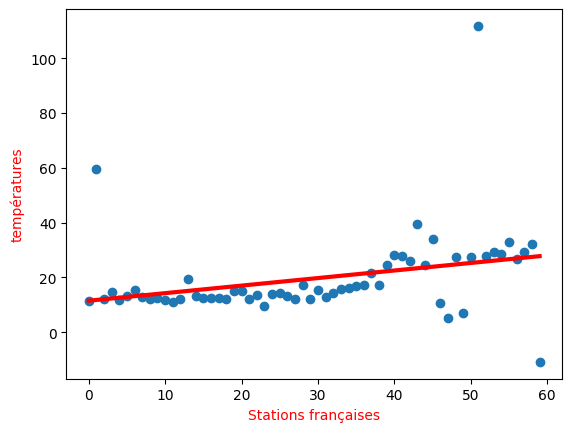

# Linear-Regression-on-dataset
Implémentation d'un algorithme de régression linéaire avec le module scikit-learn sur un dataset météorologique afin de prédire la courbe de température d'un petit dataset

# Dataset prévisualisation

# Courbe de prédiction linéaire après implémentation algorithme

